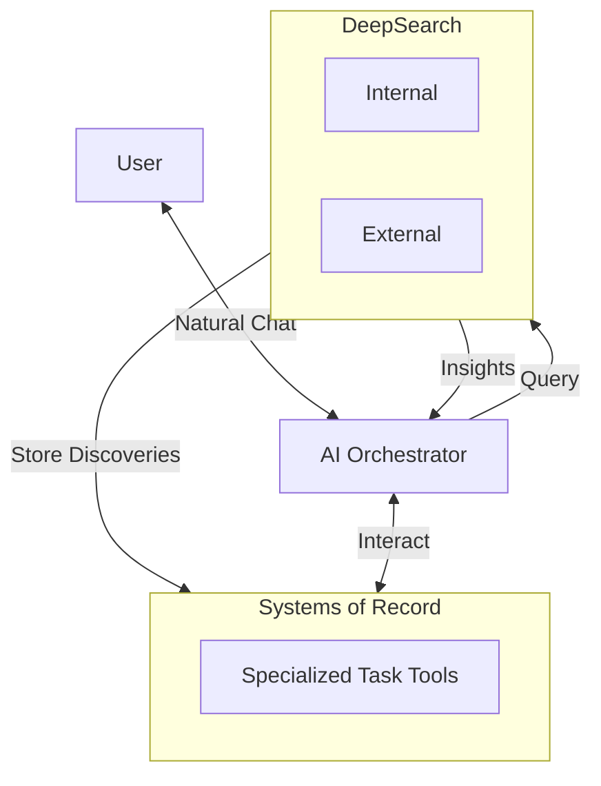

# 🌌 Asteria – AI-powered Productivity System

Asteria integrates AI with specialized tools to create a unified productivity system. Our goal: manage projects, tasks, and research without constant context switching.

---

## 🚀 Core Components

Three essential parts that must work together:

- 🧠 **AI Orchestrator**  
  Central hub using MCP to coordinate between tools.

- 🔍 **DeepSearch**  
  - **External**: Web search for real-time information
  - **Internal**: Context-aware search across knowledge tools

- 📊 **Systems of Record**  
  Best-in-class specialized tools (Todoist, Linear, Attio)

Our research indicates no current solution combines these effectively.

---

## 📋 Research Findings (April 2025)

We evaluated major AI platforms as potential orchestrators:

### Claude
- 🟠 Paid subscription (rate-limited)
- 🔴 No external DeepSearch
- 🔴 No internal DeepSearch
- 🟢 Easy MCP setup
- 🟡 Limited mobile access
- 🟢 High-performance AI

### Cursor
- 🟠 Paid subscription (rate-limited)
- 🔴 No external DeepSearch
- 🔴 No internal DeepSearch
- 🟡 Complex MCP setup
- 🔴 No mobile access
- 🟢 High-performance AI

### OpenAI
- 🟠 Paid subscription (rate-limited)
- 🟢 External DeepSearch
- 🔴 No internal DeepSearch
- 🟠 MCP coming soon
- 🟡 Limited mobile access
- 🟢 High-performance AI

### Notion AI
- 🟠 Paid subscription
- 🟠 Underperforming internal DeepSearch
- 🔴 No external DeepSearch
- 🔴 No MCP
- 🟢 Full mobile access
- 🔴 Underperforming AI

### Obsidian
- 🟡 Paid subscription (for cloud hosting)
- 🟡 Average internal DeepSearch
- 🔴 No external DeepSearch
- 🔴 No MCP
- 🟢 Full mobile access
- 🟡 Average AI integration

**Status**: We continue searching for a solution that integrates all three components effectively.

---

## 🌠 System Architecture

How it works:
- Talk to the AI normally
- AI coordinates specialized tools and search capabilities
- Search can store discoveries directly into tools
- All information flows through the AI

---

## 🛠️ Why Specialized Tools Beat All-in-One Solutions

We prioritize purpose-built tools over generalists like Notion because:

- **Superior Functionality**: Tools like Linear excel at their specific purpose
- **Structured Data**: Specialized tools have cleaner data schemas
- **Robust APIs**: Better integration capabilities
- **Focused UX**: Interfaces optimized for specific workflows

These tools work better with AI because:
- Clearer data makes AI interactions more predictable
- Well-defined schemas enable more accurate queries
- Domain-specific features can be fully leveraged

---

## 🔌 Integration Targets

### 📋 Task Management
- **Todoist**: Cross-platform with advanced filtering
- **Things3**: Premium Apple ecosystem task manager

### 🛠️ Engineering
- **Linear**: Modern issue tracking
- **Jira**: Enterprise project management
- **GitHub**: Code and issue management

### 📊 Data & Analytics
- **Datadog**: Infrastructure monitoring
- **BigQuery**: Data warehouse
- **PostHog**: Product analytics with feature flags
- **Mixpanel**: User behavior tracking
- **Google Analytics**: Web traffic analysis

### 📝 Product Management
- **Cycle**: Roadmaps and feedback
- **Notion**: Documentation
- **Jira**: Requirements tracking

### 💼 Sales & CRM
- **Attio**: Next-gen relationship management
- **Salesforce**: Enterprise CRM
- **HubSpot**: Marketing, sales, and service platform
- **Pipedrive**: Sales pipeline management

### 📢 Marketing
- **HubSpot Marketing**: Inbound marketing
- **Mailchimp**: Email campaigns
- **Buffer**: Social media scheduling
- **Ahrefs**: SEO research

### 🎧 Customer Support
- **Intercom**: Messaging and chatbots
- **Zendesk**: Support ticket system
- **Front**: Shared inbox
- **Help Scout**: Customer support

### 📊 Operations
- **QuickBooks**: Financial management
- **Asana**: Project tracking
- **Monday.com**: Cross-functional workflows
- **Workday**: Enterprise resource planning

### 📚 Knowledge Management
- **Confluence**: Team documentation
- **Coda**: Interactive docs
- **Obsidian**: Local markdown knowledge base
- **Notion**: Knowledge hub

### 🎙️ Meeting & Voice Recorders
- **Granola**: AI meeting assistant with smart summaries
- **Grain**: Video meeting recording and highlights
- **Voicenotes.ai**: Voice memo transcription and organization
- **Otter.ai**: Real-time transcription and meeting notes
- **Fireflies.ai**: Conversation intelligence platform

### 🧰 Communication
- **Slack**: Team messaging
- **Google Workspace**: Email and collaboration

---

## 🌟 Join the Project

We're actively exploring solutions as AI technology evolves. Share your ideas or experiences to help build the ideal productivity system.

---

## ✨ Why "Asteria"?

In Greek mythology, Asteria was the goddess of shooting stars. Like ancient navigators used stars to find their way, Asteria helps navigate through the complex universe of digital tools and information.

---

## 🚀 License

[MIT License](LICENSE)

--