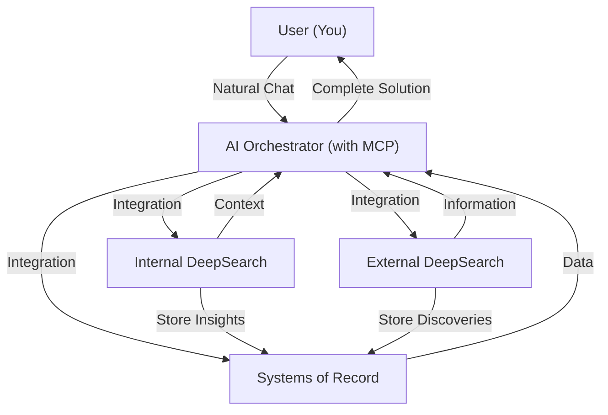

# 🌌 Asteria – Your Stellar Productivity System

**Asteria** is a productivity methodology that seeks to create the perfect **personal knowledge system**—helping you manage projects, tasks, research, and insights effortlessly through the power of AI and integrated productivity tools.

The vision is to create a seamless workflow where complex tasks become simpler through intelligent orchestration across your productivity toolkit.

---

## 🚀 Core Philosophy: The Ideal Productivity System

Asteria envisions productivity as three essential components working in harmony:

- 🧠 **AI Orchestrator**  
  An intelligent central hub with MCP capabilities to coordinate actions across tools and services.

- 🔍 **DeepSearch Capability**  
  - **External**: Powerful web search integration for real-time information gathering
  - **Internal**: Deep context-aware searching across your knowledge tools (Notion, Linear, etc.)

- 📊 **Systems of Record**  
  The best-in-class productivity tools for specific domains (Todoist, Notion, Linear, Attio)

Together, these components would create an unparalleled productivity system—but as our research shows, the perfect combination remains elusive.

---

## 📋 Research Findings (April 10, 2025)

We've evaluated several AI platforms as potential orchestrators, but none yet meets all our requirements:

### Claude
- 🟠 Requires paid subscription (rate-limited)
- 🔴 No external DeepSearch functionality
- 🔴 No internal DeepSearch functionality
- 🟢 MCP easy to install and functional
- 🟡 Partially mobile accessible
- 🟢 High-performance AI

### Cursor
- 🟠 Requires paid subscription (rate-limited)
- 🔴 No external DeepSearch functionality
- 🔴 No internal DeepSearch functionality
- 🟡 MCP harder to install
- 🔴 Not mobile accessible
- 🟢 High-performance AI

### OpenAI
- 🟠 Requires paid subscription (rate-limited)
- 🟢 External DeepSearch functionality
- 🔴 No internal DeepSearch functionality
- 🟠 MCP not available yet (coming soon)
- 🟡 Partially mobile accessible
- 🟢 High-performance AI

### Notion AI
- 🟠 Requires paid subscription (rate-limited)
- 🟢 Internal DeepSearch functionality
- 🔴 No external DeepSearch functionality
- 🔴 MCP not available
- 🟢 Mobile accessible
- 🔴 AI quality insufficient

**Current Status**: We're still searching for the ideal solution that combines all three essential components effectively.

---

## 🌠 Ideal System Architecture

In this ideal system:

- You communicate naturally with the AI orchestrator
- The AI intelligently coordinates across your productivity tools
- DeepSearch capabilities provide comprehensive context from both internal systems and the web
- DeepSearch can directly store valuable insights and discoveries into your systems of record
- All inputs are synthesized into coherent, actionable insights

---

## 🛠️ Tool Philosophy: Specialized Over All-in-One

A fundamental principle of Asteria is the belief in **specialized, task-specific tools** rather than all-in-one solutions. While platforms like Notion offer impressive versatility, they often compromise on depth and specialized functionality.

### Why Specialized Tools Win

- **Purpose-Built Excellence**: Tools like Linear are designed specifically for engineering workflows, providing deeper capabilities than generalized solutions.
- **Clearer Data Structures**: Specialized tools maintain well-defined schemas that are easier to query and integrate with AI systems.
- **Better API Integrations**: Purpose-built tools typically offer more comprehensive API access to their specialized features.
- **Optimized UX**: Specialized interfaces are tailored to specific workflows, increasing efficiency and reducing friction.

### AI Orchestration Benefits

This best-of-breed approach particularly shines with AI orchestration:

- **Clearer Data Mapping**: Well-defined data sources make it easier for the AI to understand context and relationships.
- **More Predictable Queries**: Specialized tools provide consistent data structures for more reliable AI interactions.
- **Domain-Specific Actions**: The AI can leverage specialized capabilities unique to each tool.

Rather than forcing all workflows into a single system like Notion, Asteria embraces the natural diversity of specialized tools while using AI to eliminate the context-switching friction typically associated with a multi-tool approach.

---

## 🔌 Integration Ecosystem: Third-Party Tools

For Asteria to reach its full potential, it needs to connect with best-in-class tools across multiple domains. These integrations (via MCP/API) would form the backbone of a comprehensive productivity system:

### 📋 Prosumer To-Do Lists
- **Todoist**: Cross-platform task management with powerful filtering and scheduling
- **Things3**: Premium Apple ecosystem task manager with elegant design and robust organization

### 🛠️ Engineering Progress Tracking
- **Linear**: Modern issue tracking for high-performance teams
- **Jira**: Enterprise-grade project and issue tracking
- **GitHub**: Code repository management and issue tracking

### 📊 Engineering Data
- **Datadog**: Infrastructure monitoring and analytics
- **BigQuery**: Cloud-based data warehouse for analytics

### 📝 Product Specifications
- **Cycle**: Product management platform for roadmaps and customer feedback
- **Notion**: All-in-one workspace for notes, docs, and product specs
- **Jira**: Feature tracking and requirements management

### 📈 Product Analytics
- **PostHog**: Product analytics platform with feature flags and session recording
- **Mixpanel**: Advanced user analytics and behavioral metrics
- **Google Analytics**: Web traffic analysis and user acquisition metrics

### 💼 Sales & CRM
- **Attio**: Next-generation relationship management platform
- **Salesforce**: Enterprise CRM platform with comprehensive sales workflow
- **HubSpot CRM**: All-in-one marketing, sales, and service platform
- **Pipedrive**: Sales pipeline management tool

### 📢 Marketing
- **HubSpot Marketing**: Inbound marketing and lead generation platform
- **Mailchimp**: Email marketing and audience management
- **Buffer**: Social media management and scheduling
- **Ahrefs**: SEO research and competitor analysis

### 🎧 Customer Support
- **Intercom**: Customer messaging platform with chatbots and support inbox
- **Zendesk**: Customer service software and support ticket system
- **Front**: Shared inbox for customer communication
- **Help Scout**: Help desk software for customer support teams

### 📊 Operations & Finance
- **QuickBooks**: Accounting software for financial management
- **Asana**: Project management and work tracking
- **Monday.com**: Work operating system for cross-functional work
- **Workday**: Enterprise resource planning system

### 📚 Knowledge Management
- **Confluence**: Team workspace for knowledge sharing
- **Coda**: Document platform that combines docs and spreadsheets
- **Obsidian**: Knowledge base that works on local Markdown files
- **Notion**: Knowledge base and document management

### 🧰 Additional Tools
- **Airtable**: Flexible database-spreadsheet hybrid
- **Slack**: Team communication and collaboration platform
- **Google Workspace**: Email, calendar, and document collaboration suite

The ideal Asteria implementation would provide seamless orchestration across these tools, enabling you to access and manipulate data without constantly switching contexts or interfaces.

---

## 🌟 Join the Journey

The quest for the perfect productivity system continues. As the AI landscape evolves rapidly, we're constantly evaluating new solutions and approaches.

Feel free to propose ideas, contribute findings, or share your own productivity system architecture as we work toward the ideal Asteria implementation.

---

## ✨ Why "Asteria"?

In Greek mythology, **Asteria** was the goddess of shooting stars and nighttime prophecy. Just as stars once guided explorers across the seas, **Asteria** represents our quest to navigate the complex universe of productivity tools and AI capabilities—bringing clarity, organization, and efficiency to our digital lives.

---

## 🚀 License

Asteria is available under the [MIT License](LICENSE)—empowering you to freely adapt, evolve, and share your productivity journey.

--