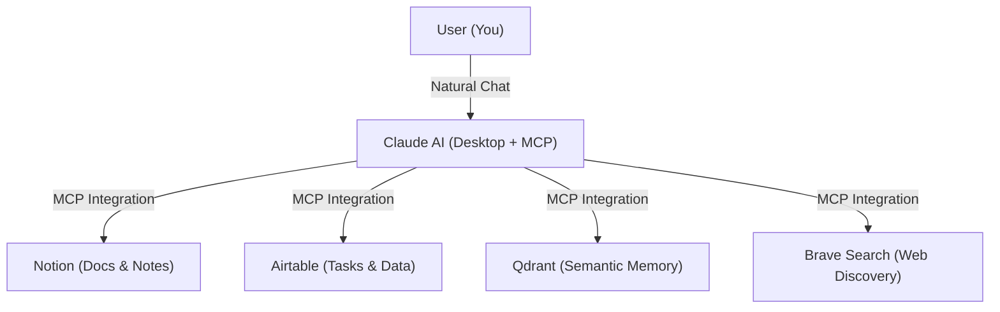
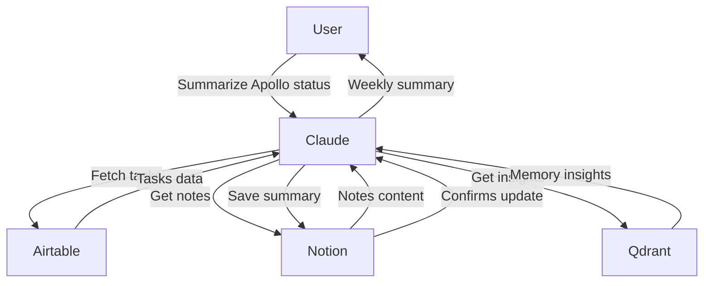

# 🌌 Asteria – Your Stellar Productivity System

**Asteria** is a productivity methodology that leverages AI and powerful productivity tools to create your own **personal solar system of knowledge**—helping you manage projects, tasks, research, and insights effortlessly.

Instead of manually navigating through scattered tools, Asteria guides you to orchestrate everything seamlessly through Anthropic's Claude AI, powered by the Model Context Protocol (MCP). Think of Claude as your central **productivity star**, intelligently connected to productivity planets—**Notion**, **Airtable**, **Qdrant**, and **Brave Search**.

✨ **With Asteria, your daily workflow becomes smoother, smarter, and brighter.**

---

## 🚀 Core Concept: Your Productivity Solar System

Picture your productivity as a **personal solar system**, with each tool orbiting the central star—Claude:

- ☀️ **Claude Desktop** *(Your Star)*  
  Acts as the central intelligence and interaction point, providing guidance and orchestrating other tools seamlessly via the MCP framework.

- 🌍 **Notion** *(Document Planet)*  
  Stores polished documents, notes, and structured knowledge accessible anytime and anywhere.

- 🪐 **Airtable** *(Data Planet)*  
  Manages tasks, projects, and structured data—keeping things orderly and actionable.

- 🌠 **Qdrant** *(Memory Comet)*  
  Provides long-term semantic memory—storing and retrieving insights and context from past experiences.

- 🌌 **Brave Search** *(Discovery Satellite)*  
  Provides real-time web search capabilities—enabling up-to-date research and insights.

Together, these components create a beautifully balanced productivity system, each tool complementing the other and revolving harmoniously around your central AI star—Claude.

---

## 🌠 How Does it Work? (High-Level)



In practice:

- You chat naturally with Claude, asking for help or making requests.
- Claude intelligently calls on each tool as needed through MCP integrations.
- Each tool provides specific assistance—writing docs, managing tasks, storing insights, or fetching information.
- Claude synthesizes all inputs, presenting coherent responses or taking actions for you seamlessly.

---

## 💫 Roadmap: Asteria Evolution

### 🚀 Mark I – Current Constellation (Version 1)

- **Claude Desktop**
  - Central AI interface
  - MCP client for orchestrating tools

- **Notion Integration**
  - Store and retrieve finalized documents
  - Manage structured notes and project documentation

- **Airtable Integration**
  - Task & project management
  - Create, query, update records and structured data

- **Qdrant Integration**
  - Long-term semantic memory storage
  - Retrieve contextually relevant past information

- **Brave Search Integration**
  - Real-time web queries
  - Up-to-date research and information discovery

### 🚀 Mark II – Planned Constellations (Future Enhancements)

- **Google Calendar**: AI-managed scheduling and event querying.
- **Messaging Apps (Slack)**: Integrate messaging for collaborative productivity.
- **Advanced Web Interaction (Puppeteer)**: Enhanced browsing and web automation.
- **Email Integration**: Intelligent email management.
- **Improved Task Reasoning**: Autonomous multi-step orchestration for complex workflows.

---

## 🌌 Detailed Usage Examples (Illustrations)

**📝 Example Scenario:** _"Summarize the status of the Apollo project this week."_



This illustrates how smoothly Claude coordinates your tools—giving you precise insights instantly.

---

## 🌠 Getting Started (macOS Setup)

**Prerequisites**:
- Install [Claude Desktop](https://claude.ai).
- Ensure Node.js (16+) is installed ([nodejs.org](https://nodejs.org)).

**Set Up Integrations**:
- **Notion**: [Create integration](https://developers.notion.com/docs/create-a-notion-integration).
- **Airtable**: [Generate personal access token](https://airtable.com/api).
- **Qdrant Cloud**: [Create a free instance](https://cloud.qdrant.io).
- **Brave Search**: [Get a Brave API Key](https://brave.com/search-api).

**Configure Claude Desktop** (use `claude_desktop_config.json`):
```json
{
  "mcpServers": {
    "notion": {
      "command": "npx",
      "args": ["-y", "@suekou/mcp-notion-server"],
      "env": { "NOTION_API_TOKEN": "YOUR_TOKEN" }
    },
    "airtable": {
      "command": "npx",
      "args": ["-y", "airtable-mcp-server"],
      "env": { "AIRTABLE_API_KEY": "YOUR_TOKEN" }
    },
    "qdrant": {
      "command": "npx",
      "args": ["-y", "@mcpservers/ragdocs"],
      "env": {
        "QDRANT_URL": "YOUR_URL",
        "QDRANT_API_KEY": "YOUR_KEY",
        "COLLECTION_NAME": "asteria_memories"
      }
    },
    "brave-search": {
      "command": "npx",
      "args": ["-y", "@modelcontextprotocol/server-brave-search"],
      "env": { "BRAVE_API_KEY": "YOUR_KEY" }
    }
  }
}
```

*(Replace placeholders with your actual API keys.)*

Restart Claude Desktop and test integrations with simple commands (e.g., "create a test Notion page" or "list Airtable tasks") to confirm setup.

---

## 🌟 Community & Contributions

Asteria is designed as an open methodology—encouraging adaptation, personalization, and contributions. Feel free to propose new systems, integrations, or open issues and discussions.

Your personal productivity solar system awaits! Join us on the journey to make it brighter.

---

## ✨ Why "Asteria"?

In Greek mythology, **Asteria** was the goddess of shooting stars and nighttime prophecy. Just as stars once guided explorers across the seas, **Asteria** guides you through the complex universe of your projects, tasks, knowledge, and insights—bringing clarity, organization, and efficiency.

---

## 🚀 License

Asteria is available under the [MIT License](LICENSE)—empowering you to freely adapt, evolve, and share your stellar productivity journey.

---

**Let your productivity shine bright with Asteria!** ✨