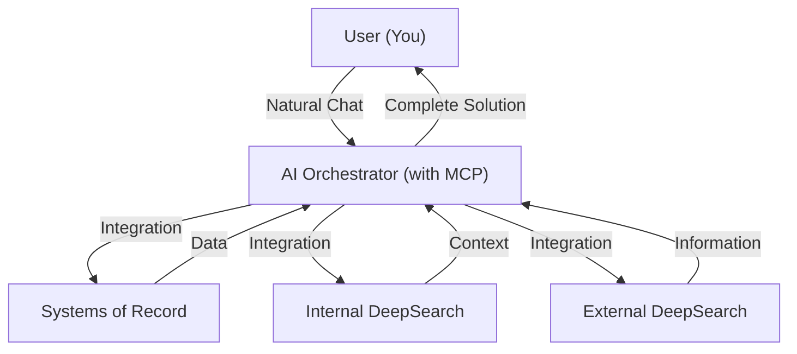

# 🌌 Asteria – Your Stellar Productivity System

**Asteria** is a productivity methodology that seeks to create the perfect **personal knowledge system**—helping you manage projects, tasks, research, and insights effortlessly through the power of AI and integrated productivity tools.

The vision is to create a seamless workflow where complex tasks become simpler through intelligent orchestration across your productivity toolkit.

---

## 🚀 Core Philosophy: The Ideal Productivity System

Asteria envisions productivity as three essential components working in harmony:

- 🧠 **AI Orchestrator**  
  An intelligent central hub with MCP capabilities to coordinate actions across tools and services.

- 🔍 **DeepSearch Capability**  
  - **External**: Powerful web search integration for real-time information gathering
  - **Internal**: Deep context-aware searching across your knowledge tools (Notion, Linear, etc.)

- 📊 **Systems of Record**  
  The best-in-class productivity tools for specific domains (Todoist, Notion, Linear, Attio)

Together, these components would create an unparalleled productivity system—but as our research shows, the perfect combination remains elusive.

---

## 📋 Research Findings (April 10, 2025)

We've evaluated several AI platforms as potential orchestrators, but none yet meets all our requirements:

### Claude
- 🟠 Requires paid subscription (rate-limited)
- 🔴 No external DeepSearch functionality
- 🔴 No internal DeepSearch functionality
- 🟢 MCP easy to install and functional
- 🟡 Partially mobile accessible
- 🟢 High-performance AI

### Cursor
- 🟠 Requires paid subscription (rate-limited)
- 🔴 No external DeepSearch functionality
- 🔴 No internal DeepSearch functionality
- 🟡 MCP harder to install
- 🔴 Not mobile accessible
- 🟢 High-performance AI

### OpenAI
- 🟠 Requires paid subscription (rate-limited)
- 🟢 External DeepSearch functionality
- 🔴 No internal DeepSearch functionality
- 🟠 MCP not available yet (coming soon)
- 🟡 Partially mobile accessible
- 🟢 High-performance AI

### Notion AI
- 🟠 Requires paid subscription (rate-limited)
- 🟢 Internal DeepSearch functionality
- 🔴 No external DeepSearch functionality
- 🔴 MCP not available
- 🟢 Mobile accessible
- 🔴 AI quality insufficient

**Current Status**: We're still searching for the ideal solution that combines all three essential components effectively.

---

## 🌠 Ideal System Architecture

In this ideal system:

- You communicate naturally with the AI orchestrator
- The AI intelligently coordinates across your productivity tools
- DeepSearch capabilities provide comprehensive context from both internal systems and the web
- All inputs are synthesized into coherent, actionable insights

---

## 🌟 Join the Journey

The quest for the perfect productivity system continues. As the AI landscape evolves rapidly, we're constantly evaluating new solutions and approaches.

Feel free to propose ideas, contribute findings, or share your own productivity system architecture as we work toward the ideal Asteria implementation.

---

## ✨ Why "Asteria"?

In Greek mythology, **Asteria** was the goddess of shooting stars and nighttime prophecy. Just as stars once guided explorers across the seas, **Asteria** represents our quest to navigate the complex universe of productivity tools and AI capabilities—bringing clarity, organization, and efficiency to our digital lives.

---

## 🚀 License

Asteria is available under the [MIT License](LICENSE)—empowering you to freely adapt, evolve, and share your productivity journey.

--